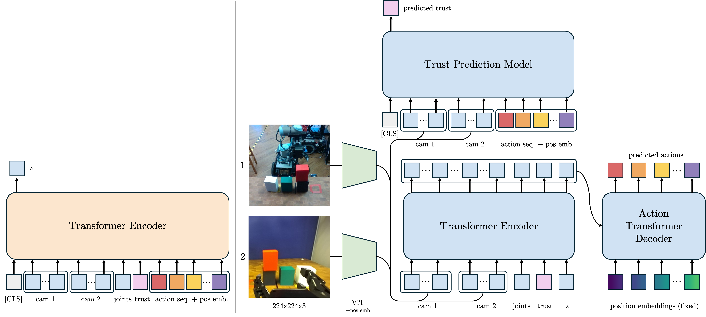

# Trust-ACT: Integrating Trust in Imitation Learning for Robotic Policy Control

This repository contains the implementation of the Trust-ACT framework, as described in our paper "Trust-ACT: Integrating Trust in Imitation Learning for Robotic Policy Control". Our approach extends the [Action Chunking Transformer (ACT)](https://github.com/tonyzhaozh/act/tree/main) framework to incorporate trust conditioning and prevent posterior collapse through partial masking.

## Overview
Trust-ACT enables:
- Trust-conditioned trajectory generation
- Diverse policy sampling through a novel partial masking scheme
- Trust-based trajectory selection using a learned trust prediction model
  
## Model Architecture



Our trust-aware imitation learning approach consists of two key components:

1. **Trust-Conditioned Policy Model**: A CVAE-based architecture where a latent variable z is inferred from demonstrated actions and states, and a transformer-based decoder predicts future actions conditioned on the latent, visual inputs (ViT-encoded), robot states, and trust embedding.

2. **Trust Prediction Model**: Processes camera views and actions to output a continuous trust score, enabling best-of-n sampling at inference time for improved trajectory selection.

The approach incorporates partial masking during training to prevent posterior collapse, ensuring meaningful latent space exploration.

## Trust-Conditioned Trajectories
Our approach generates distinct trajectories based on trust levels:


From left to right:
- **High Trust**: Direct, confident movements with efficient paths
- **Medium Trust**: Balanced trajectories with moderate caution
- **Low Trust**: More hesitant movements with increased path exploration

## Setup
### Environment Setup
Create a Conda environment with Python 3.9:
```bash
conda create --name trust-act python=3.9
conda activate trust-act
```

### Install Dependencies
Install the necessary Python packages:
```bash
pip install -r requirements.txt
```
Additionally, `ffmpeg` needs to be installed as a system-level dependency:
```bash
conda install -c conda-forge ffmpeg
```

## Dataset Preparation
Convert raw data from the robot (includes meta.pkl files and camera images) into a processed dataset. This process:
- Normalizes the data using computed statistics (min, max, mean, std)
- Processes and resizes images
- Creates visualization grids showing trust-conditioned behaviors

### Data Structure
The raw data should be organized as follows (camera names can be adjusted according to your setup):
```bash
data/
└── <task>/                           # Task folder (e.g., "stacking", "sorting")
    └── <collection_date>/            # Date of data collection
        └── <timestamp>/              # Individual episode timestamp
            ├── <camera1>_depth.png   # Depth image from camera 1
            ├── <camera1>_rgb.jpg     # RGB image from camera 1
            ├── meta.pkl              # Episode metadata and states
            ├── <camera2>_depth.png   # Depth image from camera 2
            └── <camera2>_rgb.jpg     # RGB image from camera 2
```

Each `meta.pkl` file contains:
- Joint positions and velocities
- End-effector states
- Robot actions
- Trust annotations (if using trust conditioning)

The script supports any number of cameras and naming conventions - just modify the camera names in `config/config.py` to match your setup.

### Optional Arguments:
- `--source_dir`: Path to the source dataset directory
- `--stride`: Interval for saving images (default: 1)
- `--num_workers`: Number of parallel workers for processing (default: CPU count - 1)
- `--save_depth`: Include to save depth images
- `--image_size`: Size to resize images to (default: 224)
- `--visualize`: Enable visualization support (default: True)

#### Example Usage
```bash
# Basic usage with default parameters
python preprocessing/convert_dataset.py --source_dir=data/stacking

# Process every 10th frame with depth images at 256x256
python preprocessing/convert_dataset.py --source_dir=data/stacking --stride=10 --save_depth --image_size=256

# Disable visualization for faster processing
python preprocessing/convert_dataset.py --source_dir=data/stacking --visualize=False
```

## Interactive Episode Analysis
Our visualization tool allows detailed analysis of robot behaviors under different trust conditions:

```bash
python preprocessing/visualize_episode.py --base_dir=<processed_dataset_dir> --episode=<episode_number>
```

The tool provides:
- Synchronized RGB and depth camera feeds from wrist and base cameras
- Real-time plots of robot actions and joint trajectories
- Trust level monitoring throughout the episode
- Interactive timeline for detailed behavioral analysis


## Vision Backbones

Trust-ACT supports multiple backbone architectures for visual feature extraction:

### Pre-trained D4R Models
- `d4r_vit`: Vision Transformer (ViT) specifically pre-trained on 1 million robot manipulation demonstrations from Data for Robotics, designed for robot perception tasks. The weights will be automatically downloaded from [Data for Robotics](https://data4robotics.github.io/).
- `d4r_resnet18`: A lightweight ResNet18 variant pre-trained on the same robotics dataset, offering a good balance between computational efficiency and performance.

The pre-trained weights are downloaded automatically on first use. Note that the initial download might take some time.

### Additional Backbone Options
Choose in your config:
```yaml
policy:
  backbone: "d4r_vit"  # Change this to select backbone
```

Available options:
- **ResNet Models**: `resnet18`, `resnet34`, `resnet50` 
  - Standard torchvision models pre-trained on ImageNet
  - Proven architecture for computer vision tasks
  
- **HuggingFace Models**: `hf_vit`
  - Access any HuggingFace Vision Transformer
  - Configure specific model in your config:
    ```yaml
    policy:
      backbone: "hf_vit"
      hf_model_name: "google/vit-base-patch16-224-in21k"  # Example model
    ```

## Training Trust-Conditioned Policies
Configure your training settings in `config/config.py`. Key features include:
- Trust conditioning parameters
- Partial masking ratio (default: 20%)
- Best-of-n sampling settings for inference

Start training with:
```bash
python scripts/train.py --task <task>
```

Trained policies are saved under `checkpoints/<task>`.

## Policy Visualizer

Tool for visualizing and analyzing robot trajectories in PyBullet. Supports both recorded trajectory playback and policy-generated predictions. Adapt the robot parameters and URDF to match your setup.

### Features
- Replay recorded trajectories with synchronized camera views
- Generate and visualize policy predictions from any timestamp
- Compare multiple predicted trajectories with actual paths
- Real-time visualization with interactive controls (replay/exit)
- Save trajectory data for analysis

### Usage

```bash
python scripts/policy_visualizer.py
```

```python
# Basic replay of recorded trajectory
visualizer.run_visualization(
    episode_dir,
    mode=VisualizationMode.RECORDED
)

# Generate predictions from specific timestamp
visualizer.run_visualization(
    episode_dir,
    mode=VisualizationMode.POLICY_FROM_TIMESTAMP,
    timestamp=10,
    save_path="trajectories.npz"
)
```


## License
This dataset is licensed under the MIT License. See the `LICENSE` file in the repository for details.


## Acknowledgments
- This work builds upon [ACT](https://github.com/tonyzhaozh/act) and [DETR](https://github.com/facebookresearch/detr)